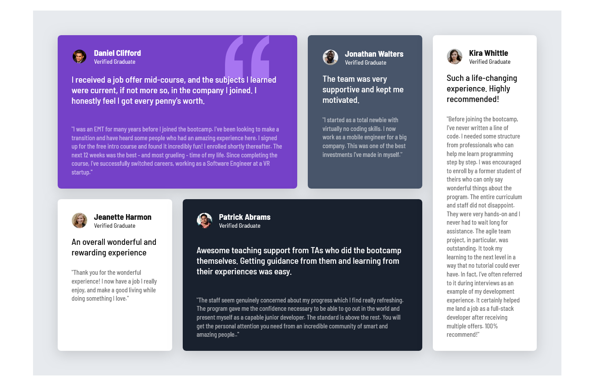

# Frontend Mentor - Testimonials grid section solution

This is a solution to the [Testimonials grid section challenge on Frontend Mentor](https://www.frontendmentor.io/challenges/testimonials-grid-section-Nnw6J7Un7). Frontend Mentor challenges help you improve your coding skills by building realistic projects.

## Table of contents

- [Overview](#overview)
  - [The challenge](#the-challenge)
  - [Screenshot](#screenshot)
  - [Links](#links)
- [My process](#my-process)
  - [Built with](#built-with)
  - [What I learned](#what-i-learned)
  - [Continued development](#continued-development)
  - [Useful resources](#useful-resources)
- [Author](#author)
- [Acknowledgments](#acknowledgments)

## Overview

### The challenge

Users has an able to:

- View the optimal layout for the site depending on their device's screen size.

### Screenshot



### Links

 - [Solution URL](https://github.com/shikurassefa/testimonials-grid)

- [Live Site URL](https://testimonials-grid-virid.vercel.app/)

## My process

### Built with

- Semantic HTML5 markup
- CSS custom properties
- Flexbox
- CSS Grid
- Mobile-first workflow


### What I learned
To be honest, this project boosted my confidence, especially with CSS Grid. I practiced using the following layout:
```CSS
.testimonials
{
display :grid;
grid-template-columns:repeat(auto-fit,minmax(260px,auto))
}
```   
When child elements of the grid span multiple columns or rows (like in my project), we need `media queries` to ensure responsiveness on different screen sizes.

### Continued development
In addition to building projects like this that focus on CSS, I want to master React to build faster, scalable applications in the future.

### Usefull Resources
. ChatGPT – Helped with quick suggestions and Grid layout references.

. CSS Tricks - A Complete Guide to Grid – [mdn]
## Author
- Frontend Mentor - [@shikurassefa](https://www.frontendmentor.io/profile/shikurassefa) 

## Acknowledgments
Special thanks to ChatGPT. We are truly living in the era of AI. Developers who learn how to effectively leverage AI will replace those who don’t. However, it's important to use it wisely—full dependency on AI can weaken problem-solving skills. Life is full of challenges, and the key is to focus on how to solve them.