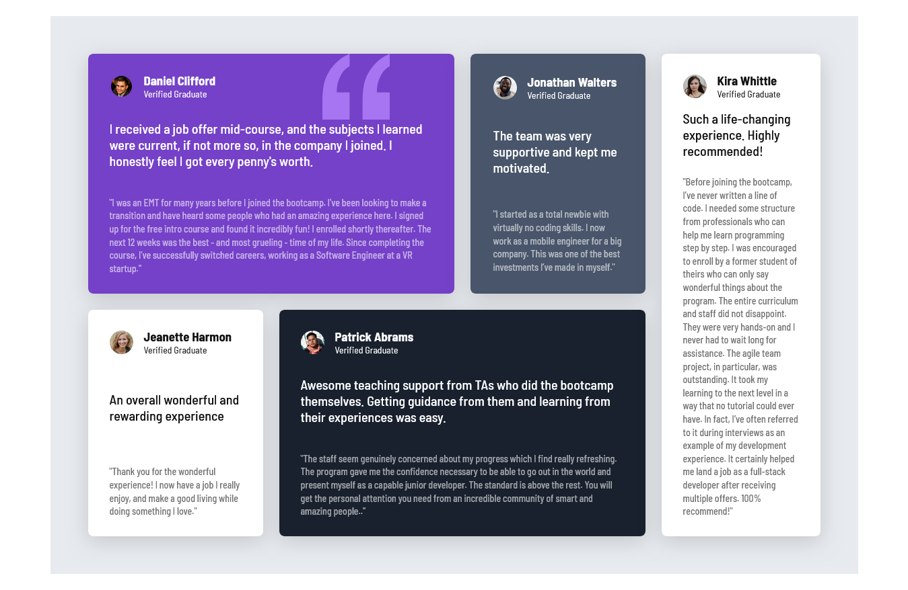

# Frontend Mentor - Testimonials grid section solution

This is a solution to the [Testimonials grid section challenge on Frontend Mentor](https://www.frontendmentor.io/challenges/testimonials-grid-section-Nnw6J7Un7). Frontend Mentor challenges help you improve your coding skills by building realistic projects.

## Table of contents

- [Overview](#overview)
  - [The challenge](#the-challenge)
  - [Screenshot](#screenshot)
  - [Links](#links)
- [My process](#my-process)
  - [Built with](#built-with)
  - [What I learned](#what-i-learned)
  - [Continued development](#continued-development)
  - [Useful resources](#useful-resources)
- [Author](#author)
- [Acknowledgments](#acknowledgments)

## Overview

### The challenge

Users has an able to:

- View the optimal layout for the site depending on their device's screen size.

### Screenshot



### Links

 - [Solution URL]:(https://github.com/shikurassefa/testimonials-grid)
 
- [Live Site URL]: (https://testimonials-grid-virid.vercel.app/)

## My process

### Built with

- Semantic HTML5 markup
- CSS custom properties
- Flexbox
- CSS Grid
- Mobile-first workflow


### What I learned
to be honest i build confidence beyond some concepts like when i use grid 
```CSS
.testimonials
{
display :grid;
grid-template-columns:repeat(auto-fit,minmax(260px,auto))
}
```   
if childrens of testimonials span some columns or rows(which is in my code) we need `media query` to achieve responsiveness.

### Continued development
in addition to bulding projects like this that needs CSS i wana to focus on mastering React and build faster and scalable applications.

### Usefull Resources
i used Chat Gpt like for suggestions so and grid reference.
## Author
- Frontend Mentor - [@shikurassefa](https://www.frontendmentor.io/profile/shikurassefa) 

## Acknowledgments
i wana to thank chat gpt as you know all,this era is an AI era it is true that developers who use AI will replace those who dont but it is critical how to use it because full depend on AI will decline our problem solving skills one thing problem is exist as long as life is continue so focus on how instead.